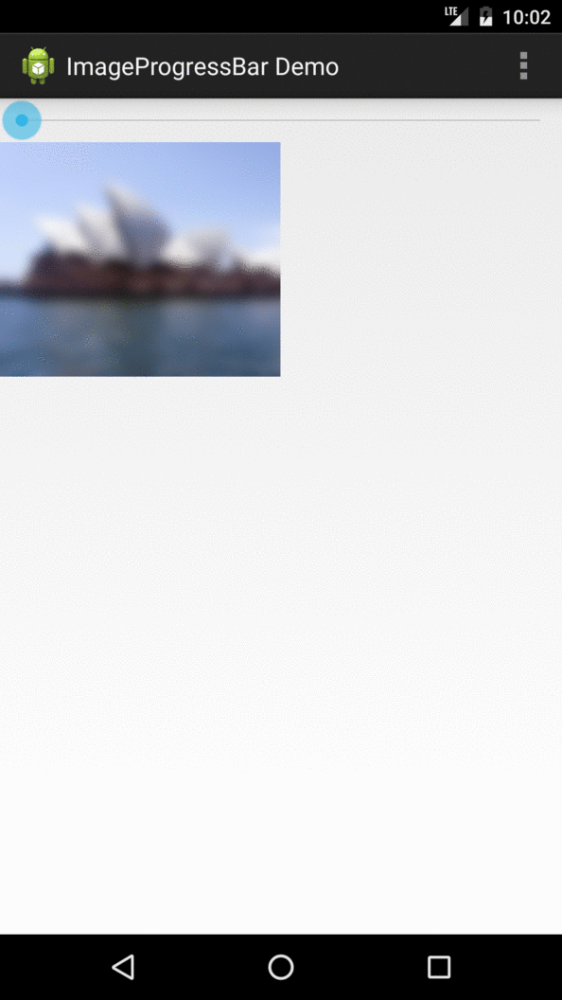
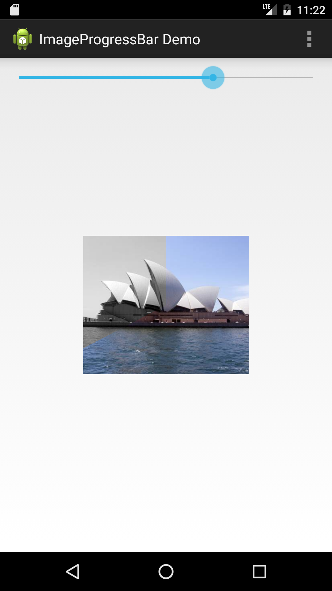

ImageProgressBar
================

Android Library of a ProgressBar as an image representation. 


This is a simple extensible android library that allows you to use an image for a loading indication. There are a couple of build-in indicators such as
 * `BlurIndicator`
   * Indicator that lets the image blur and sharpens it when the progress is running.
 * `ColorFillerIndicator`
    * Indicator that fills the image from black and white to color. The indication can be done from
      left to right, right to left, top to bottom and bottom to top.
 * `PixelizeIndicator`
    * Indicator that pixelizes the image and sharpens when the progress is running.
 * `CircularIndicator`
    * Indicator that fills the image from black and white to color with a circle animation.
 * `AlphaIndicator`
    * Indicator that fades the image from black and white to color when the progress is running.
 * `RandomBlockIndicator`
    * Indicator that fills the image from black and white to color by randomly adding block-slices
      of the image in color.
 * `RandomStripeIndicator`
    * Indicator that fills the image from black and white to color by randomly adding slices of the
      image in color.
 * `SpiralIndicator`
    * Indicator that fills the image from black and white to color with a spiral animation.

#### Examples

A blur-progress Indicator



##### A circulation progress indicator




#### Bind it in your layout

```xml
<eu.bakici.imageprogressbar.ProgressImageView
	android:id="@+id/image"
	android:layout_width="wrap_content"
	android:layout_height="wrap_content"
	android:src="@drawable/sidney" />
```

The indicators are set with the following calls:
```java
ProgressImageView progressImageView = (ProgressImageView) findViewById(R.id.image);
progressImageView.setProgressIndicator(new CircularIndicator());
```

and updated with
```java
progressImageView.setProgress(50));
```

### Build your own indicator

The ProgressImageView is designed to bind various progress indicator representations. This is provided by the class ProgressIndicator.

```java
public abstract class ProgressIndicator {
   public ProgressIndicator(@ProgressionType int progression) {
      this.progression = progression;
   }

   /**
    * This method is optional.
    * Called once at the beginning before the action progress is called. This method
    * allows for instance to do some Bitmap manipulation before the progress starts.
    *
    * @param originalBitmap the original bitmap.
    */
   public Bitmap getPreProgressBitmap(@NonNull Bitmap originalBitmap) {
      // pre process your bitmap here first
      // (e.g. make grayscale) and make sure to return the manipulated bitmap.
   }

   /**
    * Called when the progress bat is moving.
    *
    * @param originalBitmap  the original bitmap.
    * @param progressPercent the values in percent. Goes from 0.0 to 1.0.
    * @return the manipulated bitmap that should be displayed based on the percentage of the progress bar.
    */
   public Bitmap getBitmap(@NonNull Bitmap originalBitmap, @FloatRange(from = 0.0, to = 1.0) float progressPercent) {
      // process your bitmap here while the progress is running
      // make sure to return the manipulated image here, too.
   }
}
```

Inherit from this class and set how your indicator should be run. There are three types on how the
ProgressImageView is processing the image manipulation:

1. `DEFAULT`
2. `CATCH_UP`

###### `DEFAULT`:

Should be used by default. If you don't need to consider jumpy progression, this is what should be
used when calling `super()`.

###### `CATCH_UP`:

This is a tricky one. Basically it is a synchronous indicator, but with an asynchronous callback.
When the progression of the progress becomes jumpy (meaning the progression is not linear), this
indicator allows to 'fill the gaps' between the progress jump (e.g. the progress jumps from 1 to 10)
. It gives you special callback where you can do 'catching up' image manipulation to let the
ImageView draw the missing gaps between e.g. 1 and 10. The processing
indicator `RandomBlockIndicator` is a `HybridIndicator`.

You need to implement the following method:

```java
/**
 * Same as {@link #onProgress(Bitmap, int)} but with a callback.
 * @param originalBitmap the original bitmap.
 * @param progressPercent the percentage of the current progress.
 * @param listener a callback listener for filling the gaps between progress jumps.
 */
public void onProgress(final Bitmap originalBitmap, @IntRange(from = 0, to = 100) int progressPercent, final OnProgressIndicationUpdatedListener listener) {
    // do you image manipulation here
	// you also get a callback for 'catching up' the progression.
}
```

With the callback interface:

```java
/**
 * Callback interface when the indication has been updated.
 */
public interface OnProgressIndicationUpdatedListener {
   void onProgressIndicationUpdated(final Bitmap bitmap);
}
```

#### Get it or [Download the latest aar.](./aar/imageprogressbar-2.0.aar)

To get it with gradle, you need to add it in your root build.gradle at the end of repositories:

```groovy
    allprojects {
   repositories {
      ...
      maven { url 'https://jitpack.io' }
   }
}
```

And then the dependency

```groovy
dependencies {
   compile 'com.github.hayribakici:imageprogressbar:2.0'
}
```

## Changelog

See [Changelog](Changelog.md)

## Licence

Apache Licence
